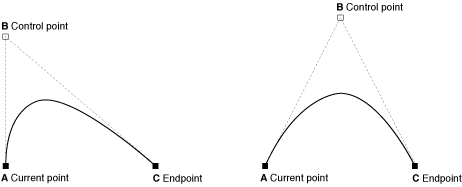

# Rectangles

> x and y starts from the top left corner

- fillRect(x, y, width, height);
  - create a solid rectangle
- strokeRect(x, y, width, height);
  - a rectangular outline
- clearRect(x, y, width, height);
  - Makes the rectangular region transparent, like it's been erased.

# Paths
> When you call `fill()` or `stroke()`, it will affect all items drawn up to the last time you called `beginPath()` and override previous fill() or stroke() function. Hence, it's important to note that you're begining a new Path/drawing.
- beginPath()
  - Indicates a new path is about to be created.
- closePath()
 - Ends the current paths and draws a straight line to join to the beginPath
 - Except if your `closePath` ends on the same place as `beginPath`
 - So, it's basically used for tidying up, especially in `stroke()`. It's not required in `fill()`
- stroke()
  - Draws outline
- fill()
 - Draws solid shape.

## Triangles
> There is no function for this, but it can be achieved with the combination of `moveTo` and `lineTo`.

- moveTo(x, y)
  - The first point.
- lineTo(x, y)
  - Where to draw to, starting from the last point indicated.

## Arcs
> Drawing arcs and of course, if you draw an arc long enough you form a circle

- arc(x, y, radius, startAngle, endAngle, anticlockwise)
  - x and y indicates the starting position.
  - startAngle and endAngle indicates where to start and end along the 360 deg. If you start at zero and end at 360, that's a circle of course.
  - Math.PI equals 180 degree.
  - anticlockwise decides the direction of drawing. It may the difference between a happy face and a sad face.
- arcTo(x1, y1, x2, y2, radius)
  - x1 and y1 = starting points
  - x2 and y2 = end points

> `arc` is usually like a part of circle, while `arcTo` is more like a bent line, so you may find some straight line and curved centre.

## QuadraticCurveTo
> Use to draw a quadratic curve
- It has just one control point
- `quadraticCurveTo(cp1x, cp1y, x, y)`
- cp1 is the control points
- x and y is the final position
- The intial position is automatically determined based on the last location of the pen e.g `beginPath`, `moveTo` or `lineTo` etc.

## BezierCurveTo
> It has two control points, *cp1* and *cp2*, that is the difference
- `bezierCurveTo(cp1x, cp1y, cp2x, cp2y, x, y)`

## rect
> It's the basis of `fillRect`, `strokeRect` and `clearRect`
- `rect(x, y, width, height)`
- It works with `fill()` and `stroke()` to achieve the desired rectangle.